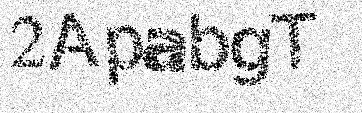
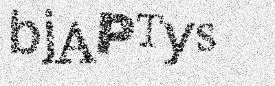

# Simple Gimp Captcha Resolver

Captcha Sample:





This simple and well-organized repo is for resolving simple captcha generated by [gimp](https://github.com/isislovecruft/gimp-captcha). It can reach about 99.7% accuracy.

model: cnn + lstm + ctc loss

reference: https://github.com/ypwhs/captcha_break

Tested environment:

```
torch===1.2.0 / 1.5.0
torchvision===0.4.0 / 0.6.0
opencv-python===4.1.0
numpy
```

## Usage

### Install dependency

```bash
pip3 install -r requirements.txt
```

model.bin is a pre-trained model which could achieve 99.7% acc.

```bash
python3 main.py --mode train --cuda True
python3 main.py --mode test --cuda True
python3 main.py --mode train --cuda True --warm-up True
```

## Interface

Please see interface.py

```bash
python3 interface.py dataset_test/yQdeva7.jpg
```

## Train trick

- 1e-4 lr train 30-epoch for warm-up
- 2e-5 lr train about 10-epoch for fine tuning
